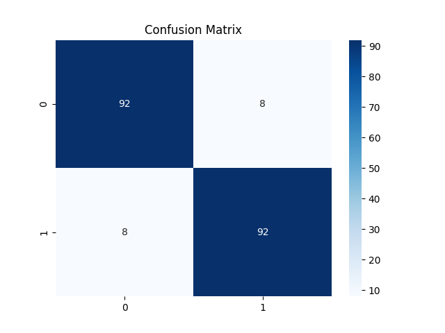

# 🧩 Classified KNN Predictor

A **full end-to-end Machine Learning pipeline** for binary classification using **K-Nearest Neighbors (KNN)**.  
Built to demonstrate clean MLOps structure, reproducibility, and deployment-ready steps.

---

## 📂 Project Structure

```

classified-knn-predictor/
├── config/
│ └── config.yaml # Project config: paths, hyperparameters
├── data/
│ ├── raw/ # Original dataset (Classified_Data)
│ ├── processed/ # Train, validation, test splits
│ └── features/ # Scaled feature data (optional)
├── models/
│ └── knn_model.pkl # Saved KNN model
├── outputs/
│ ├── confusion_matrix.png # Test confusion matrix plot
│ ├── roc_curve.png # Test ROC curve plot
│ ├── class_distribution.png # Class distribution of target
│ └── classification_report.txt # Test classification report
├── src/
│ ├── data/
│ │ └── preprocess.py # Splits & saves raw data
│ ├── features/
│ │ └── build_features.py # Scales numeric features
│ ├── models/
│ │ ├── train_model.py # Trains KNN model
│ │ └── evaluate_test.py # Evaluates on test set
│ └── utils/
│ └── helpers.py # Reusable utils (optional)
├── run.py # One-click pipeline runner
├── requirements.txt # Dependencies
├── .gitignore
└── README.md

````

---

## ⚙️ How to Run

1️⃣ **Preprocess & split data**  
2️⃣ **Scale features**  
3️⃣ **Train & validate KNN**  
4️⃣ **Evaluate test performance**  

**Run all in one go:**

```bash
python run.py
```

**Or Run Entire Pipeline:**

```bash
python run.py
```

---

## ✅ Final Results

| Metric           | Validation | Test  |
| ---------------- | ---------- | ----- |
| Accuracy         | 93.5%      | 92.0% |
| Precision (0)    | 0.97       | 0.92  |
| Recall (0)       | 0.90       | 0.92  |
| Precision (1)    | 0.91       | 0.92  |
| Recall (1)       | 0.97       | 0.92  |
| f1-score (macro) | 0.93       | 0.92  |


---
⚙️ Tech Stack
Python 🐍

Scikit-Learn

Pandas & NumPy

Matplotlib

Clean YAML configs

Modular pipeline

## 📊 Outputs

## 🏆 Author
MD TARIKUL ISLAM UTHSO